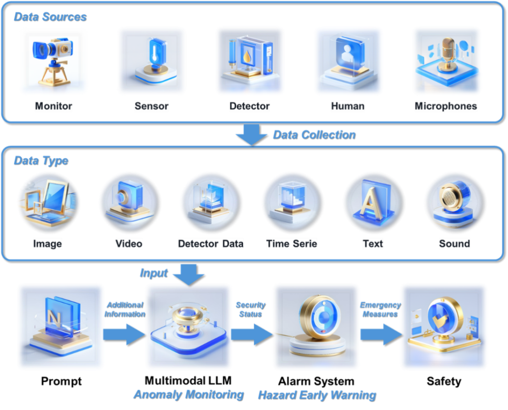

# MLLM_For_Chemical_Safety
Laboratory safety is of paramount importance, yet traditional monitoring systems often struggle to predict and prevent incidents effectively. This study explores the application of the Multimodal Large Language Model (MLLM) to enhance chemical laboratory safety by enabling anomaly detection and early warning systems. We detail a meticulously designed prompt engineering strategy that guides MLLM to analyze diverse data sources, including time series, video, image, audio, detector data, and text from human input, for anomaly detection. Furthermore, we develop an innovative alarm system that leverages the anomaly detection result of multiple MLLM to predict potential hazards. Our findings highlight the significant potential of MLLM to transform laboratory safety practices, paving the way for future research and development of intelligent systems that proactively mitigate risks and ensure a secure research environment.

